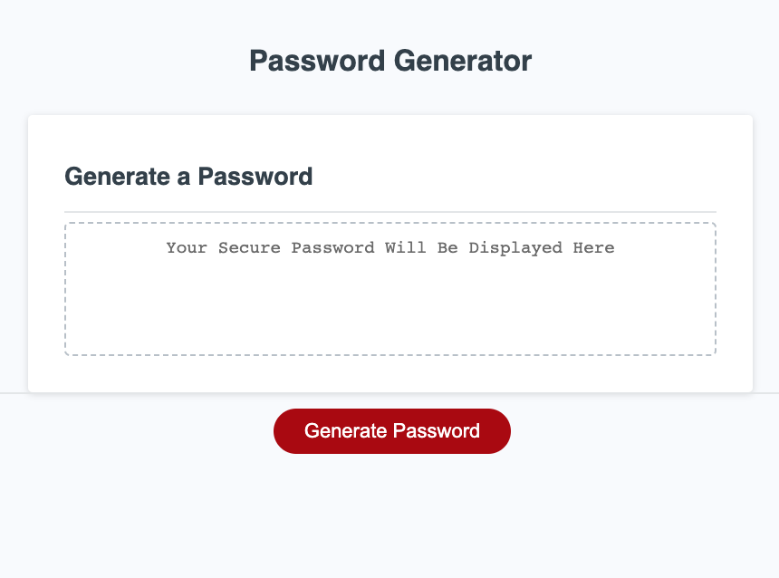

# Password-Generator

## This Week's Task

This week's task was to modify the starter code to populate an online password generator application. 

## User Story
Users of this password generator can use it to generate a secure password to protect their sensitive data. The randomness of the generator will provide the users with greater security.

## Acceptance Criteria
GIVEN I need a new, secure password
WHEN I click the button to generate a password
THEN I am presented with a series of prompts for password criteria
WHEN prompted for password criteria
THEN I select which criteria to include in the password
WHEN prompted for the length of the password
THEN I choose a length of at least 8 characters and no more than 128 characters
WHEN asked for character types to include in the password
THEN I confirm whether or not to include lowercase, uppercase, numeric, and/or special characters
WHEN I answer each prompt
THEN my input should be validated and at least one character type should be selected
WHEN all prompts are answered
THEN a password is generated that matches the selected criteria
WHEN the password is generated
THEN the password is either displayed in an alert or written to the page

## Mock-up

The following image shows the web application's appearance and functionality:

## Live link
https://mohanbeckford.github.io/generator/
